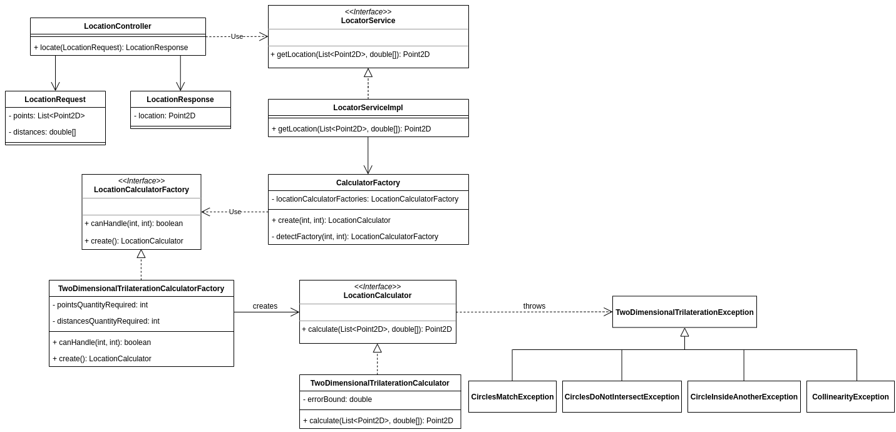
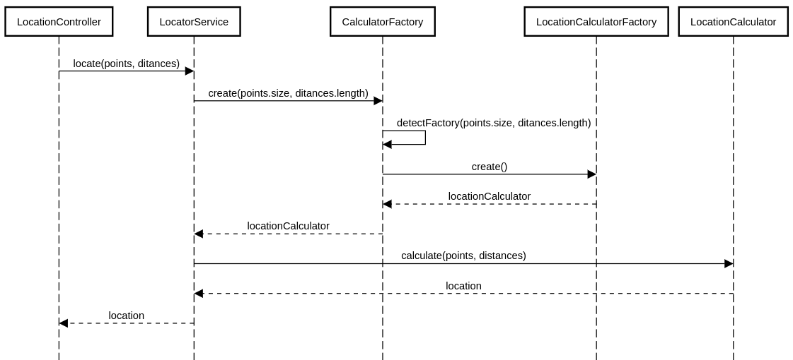

# DESAFIO TÉCNICO - MELI
## Operación de fuego quasar

## location-api

### Objetivo
Esta API tiene como fin brindar el servicio para, a partir de 3 puntos (P1, P2, P3) y 3 distancias de un punto Pk hacia cada uno de estos puntos anteriores, calcular las coordenadas del punto Pk.

### Especificación

#### Tecnologías
Las tecnologías que se utilizaron son:
- Java 1.8
- Maven
- SpringBoot

La API se encuentra hosteada en **heroku**, que es un servicio de hosting que brinda opciones para hostear APIs de manera gratuita. Para más información puede ingresar a www.heroku.com.

**URL del servicio: https://salva-location-api.herokuapp.com/locations**

#### Llamadas provistas
Realizando un POST a la URL https://salva-location-api.herokuapp.com/locations se recibe como respuesta la ubicación del punto Pk.

#### Ejemplo del Body del POST

```JSON
{
  "points": [
    {
      "x": 50,
      "y": 0
    },
    {
      "x": 200,
      "y": 0
    },
    {
      "x": 200.7,
      "y": -150.1
    }
  ],
 "distances": [
    150,
    350,
    561.2
  ]
}
```
Y el Response con código 200 y body:
```JSON
{
  "location": {
    "x": -100,
    "y": 75.5
  },
}
```
En caso de no poderse determinar la posición del punto Pk se retorna un response con mensaje de error y código 404.

### Diagramas

#### Diagrama de Clases


#### Diagrama de Secuencia
##### Cálculo de ubicación - flujo normal


## Anexo
### Explicación algoritmo Trilateración Bidimensional

La trilateración es la forma en que los GPS calculan la posición del usuario basandose en la información obtenida en otros 3 puntos conocidos. De esta forma, se es capaz de calcular la distancia entre estos puntos conocidos y el punto donde se encuentra el usuario.

Entonces, disponemos de 3 puntos en el plano: P1, P2, P3 y sabemos la distancia de cada punto al punto Pk (el que queremos averiguar).
Con esta información a disposición, podemos utilizar este algoritmo para determinar las coordenadas del punto Pk.

La idea del algoritmo es trabajar con circulos, donde el centro de cada circulo será un punto conocido y el radio del mismo será la distancia de este hasta el punto Pk.

De esta forma, los pasos a seguir son:
- Tomar 2 puntos como P1 y P2.
- Resolver una fórmula matemática para determinar los 2 puntos donde estos se intersectan.
- Determinar cuál punto de estos 2 posibles puntos aplican en la fórmula del circulo formado con P3.

Ahora bien, no siempre seremos capaces de obtener este punto Pk:
- Si uno de los circulos que formamos coincide con al menos otro circulo, entonces realmente disponemos solo de 2 puntos conocidos distintos por lo que no seremos capaces de calcular el punto Pk.
- Si uno de los circulos no se intersecta con al menos otro circulo, no hay solución.
- Si los 3 puntos son colineales (pertenecen a la misma recta) y ademas se intersectan en más de un punto, no se puede determinar el punto Pk.

Fuentes: 
- http://paulbourke.net/geometry/circlesphere/ (sección: Intersection of two circles)
- https://math.stackexchange.com/questions/100448/finding-location-of-a-point-on-2d-plane-given-the-distances-to-three-other-know 

Extra: Una página web de utilidad para poder ver los distintos casos de manera gráfica, y así poder entenderlos de mejor manera, es https://www.desmos.com/calculator/kx5lufxcx7 (recordar que la fórmula de un circulo es: (x - dx)² + (y - dy)² = r² siendo dx la distancia del punto hacia el eje X, dy la distancia del punto hacia el eje Y, y r el radio del circulo - en este caso la distancia hacia el punto Pk).
